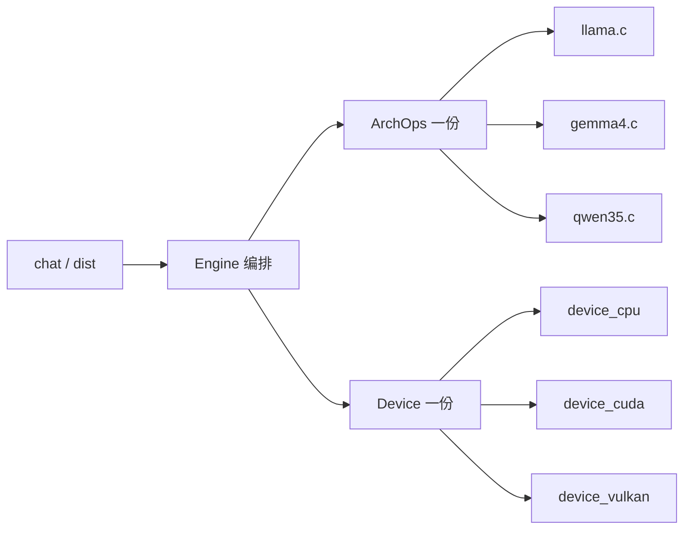
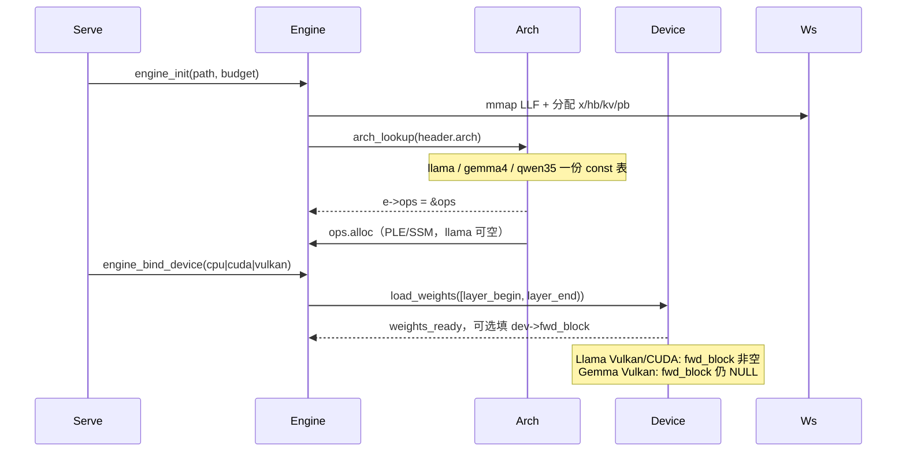
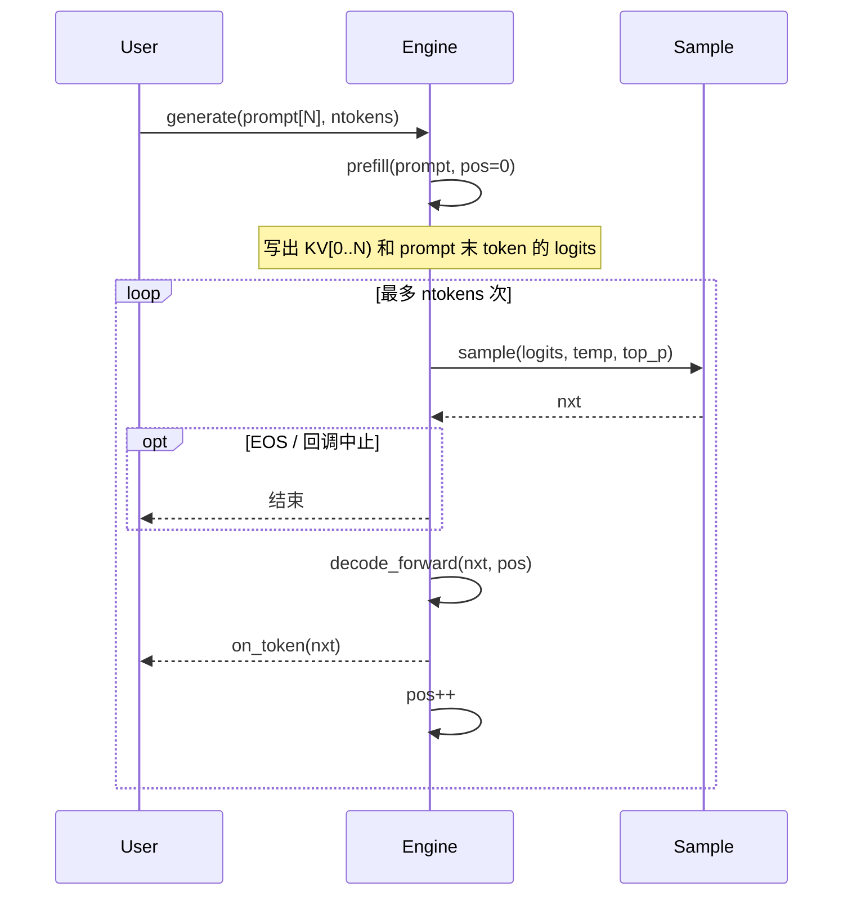
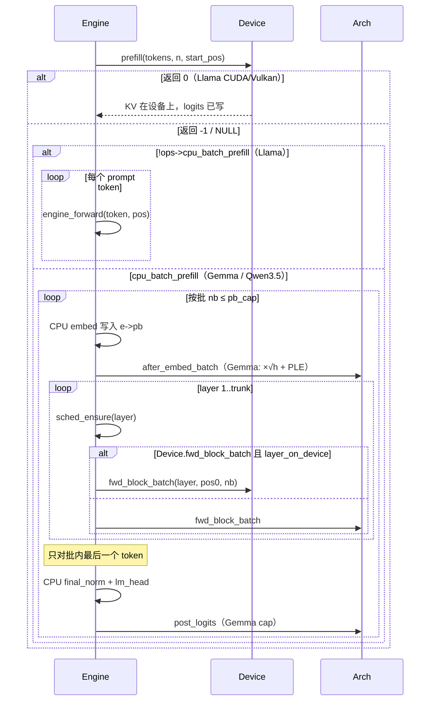
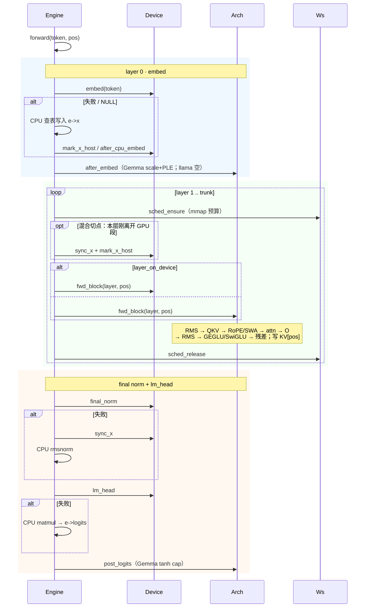

# Engine / Arch / Device

版本：v1.0 ｜ 状态：第一期已落地（CPU 图仍大部分在 `engine.c`，Arch 先挂表）  
关联：[design-gpu-inference.md](design-gpu-inference.md) · [design-mobile.md](design-mobile.md) · [qwen35-arch.md](qwen35-arch.md)

推理拆成两轴，避免 `engine.c` 里铺 `if (ARCH_*)` × `if (DEV_MODE_*)`，也避免按「模型 × 后端」复制 shader / kernel。

| 轴 | 管什么 | 不管什么 |
|----|--------|----------|
| **Arch** | 图：RoPE、q_dim、GEGLU/SwiGLU、SWA、PLE、GDN、logit cap | SSBO、cublas、权上卡 |
| **Device** | 权/KV 在哪、embed/norm/lm/prefill/GEMV | GEGLU、PLE、SWA 语义 |
| **Engine** | 编排：init/bind、prefill/decode、sample、mmap 调度、混合切层 | 具体图或具体 GPU API |

```text
serve / dist / sample
        │  仍只调 engine_forward*
        ▼
     Engine          状态：x/hb/kv/pb、layer_begin/end、gpu_layer_end
        │
        ├── const ArchOps* ops     llama.c / qwen.c / gemma4.c / qwen35.c
        └── Device* dev            cpu / cuda / vulkan
```

`fwd_block` **不**作为 Engine 一等字段。Arch 表永远是 CPU 图且 `const`；Device 可选覆盖。热路径只选一次：

```c
engine_call_fwd_block(e, layer, pos):
    if (layer_on_device(e, layer))   /* Device.fwd_block 且层在 GPU 段 */
        return e->dev->fwd_block(e, layer, pos);
    return e->ops->fwd_block(e, layer, pos);
```

---

## 1. 结构体

### 1.1 Engine（状态 + 编排）

共用缓冲仍挂 Engine。Gemma PLE / Qwen3.5 SSM 第一期也仍在 Engine 上，之后可收进 `arch_ctx`。

```c
typedef struct Engine {
    Ws ws;
    const ArchOps* ops;     /* arch_lookup(header.arch)，const 表 */
    uint32_t arch;          /* 与 ops->id 相同，日志用 */
    Device* dev;

    uint16_t* kv;
    void* d_kv;
    void* w_dev;
    float *x, *hb, *hb2, *ffn, *att, *logits;
    float *pb, *pb2, *pbq, *pbk, *pbv, *pbg, *pbu, *pba;
    /* gemma/qwen35 专用: ple*, ssm_*, rope_if_* */

    uint32_t layer_begin, layer_end;  /* PP：本 rank 层段 */
    uint32_t gpu_layer_end;           /* 单进程混合，见 §4 */
    DeviceMode device_mode;
} Engine;
```

对外 API 不变：`engine_init` / `engine_bind_device` / `engine_forward` / `engine_forward_prefill` / `engine_generate`。

层号：`0` embed，`1..n_blocks` transformer，`n_blocks+1` final norm，`n_blocks+2` lm_head。

### 1.2 ArchOps（一个模型一份，const）

头文件：`inference/include/arch.h`。表：`inference/arch/{llama,qwen,gemma4,qwen35}.c`，`arch_lookup` 在 `arch.c`。

```c
typedef struct ArchOps {
    const char* name;
    uint32_t id;
    int cpu_batch_prefill;   /* 1=GPU prefill 失败走 CPU 批(gemma4/qwen35) */

    int  (*alloc)(Engine* e);          /* 第一期可空；PLE/SSM 仍在 engine_init */
    void (*free)(Engine* e);
    void (*after_embed)(Engine* e, uint32_t token);
    void (*after_embed_batch)(Engine* e, const uint32_t* tokens, uint32_t B);
    void (*refresh_ple_pp)(Engine* e, uint32_t token);
    void (*post_logits)(Engine* e);

    int (*fwd_block)(Engine* e, uint32_t layer, uint32_t pos);
    int (*fwd_block_batch)(Engine* e, uint32_t layer, uint32_t pos0, uint32_t B);
} ArchOps;
```

| 文件 | CPU 图 | `cpu_batch_prefill` | Device 覆盖（现在） |
|------|--------|---------------------|---------------------|
| `llama.c` | 默认块 + batch | 0 | Vulkan/CUDA fused → `dev->fwd_block` |
| `qwen.c` | 同块；RoPE 在 `engine_fwd_block_at` / CUDA 按 header 分支 | 0 | 同 llama |
| `gemma4.c` | decode 仍走 `engine_fwd_block_at` 的 Gemma 路径；batch 单独 | 1 | **不挂** GPU 块（fused 是 LLaMA 形） |
| `qwen35.c` | GDN + gated attn | 1 | **不挂** GPU 块 |

`after_embed`：Gemma 做 `×√hidden` + PLE；llama/qwen 为 NULL。  
`post_logits`：Gemma final tanh cap。

CPU 块实现第一期仍在 `engine.c`（`arch_llama_fwd_block` 等），表只引用符号。目标是把图迁进对应 `arch/*.c`。

### 1.3 Device（一个后端一份）

`0` 成功，`-1` 或 NULL → Engine 走 CPU / Arch。

```c
typedef struct Device {
    DeviceKind kind;
    int id;
    void* handle;

    int  (*load_weights)(Engine*, char* err, size_t);
    void (*free_dev)(Engine*);
    int  (*prefetch_layer)(Engine*, uint32_t layer);
    void (*release_layer)(Engine*, uint32_t layer);

    int  (*embed)(Engine*, uint32_t token);
    void (*after_cpu_embed)(Engine*);
    int  (*final_norm)(Engine*);
    int  (*lm_head)(Engine*);          /* Vulkan：内部可 fused */
    int  (*prefill)(Engine*, const uint32_t* tok, int n, int pos0);
    void (*sync_x)(Engine*);
    void (*mark_x_host)(Engine*);
    int  (*forward_batch_x)(Engine*, const float* xin, int n, uint32_t pos,
                            float* x_out, float* logits_out);
    int  (*fwd_block)(Engine*, uint32_t layer, uint32_t pos);      /* 可 NULL */
    int  (*fwd_block_batch)(Engine*, uint32_t layer, uint32_t pos0, uint32_t B);
} Device;
```

| 后端 | embed / prefill / lm | `fwd_block` |
|------|----------------------|-------------|
| CPU | 全 NULL | NULL → 全走 Arch |
| CUDA | `cuda_*` | `cuda_attach_fwd` 挂上 |
| Vulkan | `vulkan_*`；`lm_head` = `vulkan_lm_or_fused` | Llama 且 kernel 就绪才挂；Gemma/Qwen3.5 保持 NULL |

`device.h` 里的 `cuda_embed` / `vulkan_prefill` 等仍是实现函数，创建 Device 时赋给指针。Engine **只走 `e->dev->*`**。

---

## 2. 绑定顺序

```text
engine_init(path)
  mmap LLF + 分配缓冲
  e->ops = arch_lookup(header.arch)
  engine_bind_device(CPU)           /* 默认；load_weights 空操作 */
serve:
  engine_bind_device(cuda|vulkan)
    load_weights([layer_begin, layer_end))
    llama: 填 dev->fwd_block（若 kernel 可用）
    gemma: 不填，transformer 仍 CPU
```

不要用 `attach_device` 去改 Engine 上的函数指针；GPU 只写 `Device.fwd_block`。`engine_attach_cpu_fwd` 现在只是把 Device 上的块覆盖清掉。

---

## 3. 推理时序图

整次推理分两段：**启动绑一次**，然后 **generate = prefill + decode 循环**。Engine 只编排；Arch 定图；Device 能跑就跑，不能就回落到 Arch 的 CPU。



### 3.1 启动（一次）



### 3.2 一次 `engine_generate`

Prefill 吃整段 prompt、写满 KV；decode 每次一个新 token，只追加一列 KV。MTP（若开）是 decode 里多一次 draft，不改变这条主时序。



### 3.3 Prefill 一条（批）

Device 能整段 prefill 就一次做完；否则 Engine 按 `pb_cap` 切批。`gpu_layer_end != 0` 时 Device.prefill **必须 -1**（不能半截 GPU 批），Engine 走逐层。



小批（低于 `PREFILL_BATCH_MIN` / Gemma 的 `PREFILL_BATCH_MIN_GEMMA4`）退化成逐 token `engine_forward`，时序与 decode 相同。

### 3.4 Decode 一个 token（热路径）

`engine_forward` → `engine_forward_range` → `forward_layer`。Device 覆盖优先，NULL 走 Arch/CPU。



`fwd_block` 内部（Arch 图，Device 只换实现）：

```text
x
 ├─ RMS(attn) ─ Q,K,V ─ RoPE ─ attn(KV cache) ─ O ─┬─ 残差
 └─────────────────────────────────────────────────┘
 ├─ RMS(ffn) ─ gate/up ─ GEGLU|SwiGLU ─ down ──────┬─ 残差 → x'
 └─────────────────────────────────────────────────┘
 K,V 写入 kv[layer, pos]
```

Gemma 还在这块里做 SWA 窗、q_dim≠hidden、PLE；Qwen3.5 部分层换成 GDN，不走这条 attn。

### 3.5 谁调谁（避免 N×M）

```text
engine_forward_prefill
  ├─ e->dev->prefill?  ──0──► 结束
  └─ -1 / NULL
        ├─ !cpu_batch_prefill ──► 逐 token engine_forward
        └─ cpu_batch_prefill  ──► CPU 批：embed + after_embed_batch
                                  + fwd_block_batch + lm + post_logits

engine_forward (decode)
  ├─ e->dev->embed? 否则 CPU embed + mark_x_host
  ├─ arch->after_embed
  ├─ engine_call_fwd_block     ← Device 覆盖或 Arch CPU
  ├─ e->dev->final_norm / lm_head 否则 CPU
  └─ arch->post_logits
```

### 3.6 三方职责

| 时刻 | Engine | Arch | Device |
|------|--------|------|--------|
| init | 缓冲、层区间 | 选表 | — |
| bind | 换 `e->dev` | — | `load_weights`，可选 `fwd_block` |
| prefill 入口 | 试 Device，失败按 `cpu_batch_prefill` | — | 整段 GPU 或 -1 |
| 每层 | mmap 调度；`layer_on_device` | 图 | GEMV / fused / KV 位置 |
| 头尾 | 指针失败回落 | `after_embed` / `post_logits` | embed / norm / lm |
| sample | softmax / top_p | — | — |

---

## 4. 混合推理（部分 GPU + 部分 CPU）

不是第三种 Device，也不是再往 Engine 上挂一套 `fwd_block`。仍是 **一个 GPU Device + 一份 Arch CPU 图**，Engine 上一个层切分。

`gpu_layer_end`（`engine_set_gpu_layers(n)`）：

- `0`：本段能 GPU 的层全走 `Device.fwd_block`
- `>0`：`i < gpu_layer_end` 走 Device，其余走 Arch CPU

`n` = transformer 块数：`gpu_layer_end = 1 + n`（含 embed）。`n >= n_blocks` → 全 GPU（置 0）。

只允许 **前 GPU、后 CPU**。不能奇数层 GPU、偶数层 CPU（attn 不跨设备读 KV）。

```text
GPU blk … → 最后一层 GPU
              Device.sync_x / mark_x_host
           → 第一层 CPU (Arch.fwd_block)
CPU blk … → CPU rmsnorm + lm_head
```

| 段 | 权 | 算 |
|----|----|----|
| GPU 层 | `load_weights` 上卡 / 流式 H2D | `Device.fwd_block` |
| CPU 层 | 已有 mmap | `Arch.fwd_block` |

PP 的 `layer_begin/end` 是进程间切层，与 `gpu_layer_end` 正交：各 rank 仍可再混合。

| 模式 | 怎么配 |
|------|--------|
| 全 CPU | `Device.fwd_block == NULL` |
| 全 GPU | 有 `fwd_block` 且 `gpu_layer_end == 0` |
| 单进程混合 | 一个 CUDA/Vulkan Device + `gpu_layer_end` |
| 多卡 PP | 各 rank 自己的 `layer_begin/end` |

Vulkan Llama fused 填了 `fwd_block` 就能前 GPU 后 CPU。Gemma 现在 `fwd_block == NULL`，切分无意义。

---

## 5. 代码地图

| 路径 | 内容 |
|------|------|
| `inference/include/arch.h` | `ArchOps` |
| `inference/include/device.h` | `Device` |
| `inference/include/yllm.h` | `Engine` + `engine_call_fwd_block` / `layer_on_device` |
| `inference/arch/*.c` | 四份 const 表 + lookup |
| `inference/core/engine.c` | 编排；CPU 图实现（待迁） |
| `inference/device/device_*.c` | 填 vtable；`load_weights` |
| `inference/cuda/cuda_fwd.c` | `cuda_attach_fwd` → `dev->fwd_block` |
| `inference/vulkan/vulkan_fwd.c` | `vulkan_attach_fwd`；Gemma skip GPU 块 |

---

## 6. 后续（未做）

1. 把 `engine_fwd_block_at` / Gemma batch / Qwen3.5 GDN 从 `engine.c` 迁进对应 `arch/*.c`。
2. PLE/SSM/rope_if 收入 `ops->alloc` + `arch_ctx`。
3. Gemma GPU：对齐 CPU greedy 后再在 `gemma4` 路径填 `Device.fwd_block`（不要改 llama fused 去迁就 Gemma）。
4. `load_weights` 可只 pack `gpu_layer_end` 之前的层以省显存。
5. Engine 热路径彻底去掉剩余的 `e->arch == ARCH_*`（块内核内部仍可按 header 分支，直到图迁完）。
